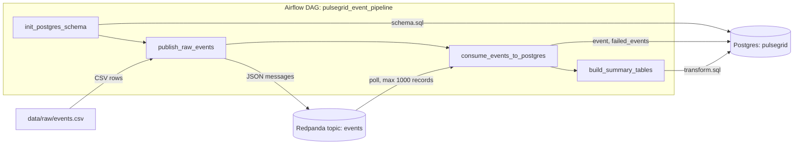
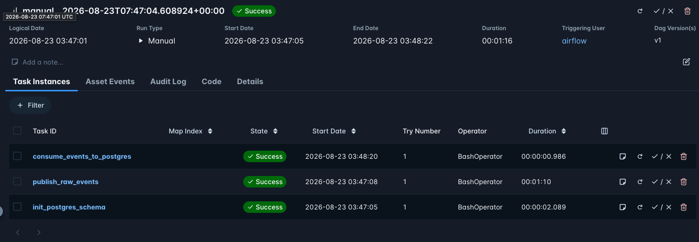

# Pulsegrid

A small batch ETL pipeline that pushes e-commerce clickstream events through Kafka into Postgres, orchestrated by Airflow.

> **This is a learning lab.**
> I built Pulsegrid to learn data engineering tools and concepts by using them, not to ship a product.
> The specific things I set out to learn were Apache Airflow, DAGs (tasks, dependencies, manual runs, logs), Kafka-style streaming with Redpanda, producer and consumer patterns, schema validation with a dead-letter table, idempotent re-runs, and the extract, load, transform split.
> Some choices here are deliberately simple so the concept stays visible.

## What it does

The input is a raw CSV of shop events, one row per `view`, `addtocart`, or `transaction`, keyed by visitor and item.
A producer publishes every row to a Kafka topic, a consumer validates each message with Pydantic and batch-inserts it into Postgres, and a SQL transform rebuilds a set of summary tables on top.
Messages that fail validation go to a `failed_events` table with the error text instead of being dropped.

Airflow runs the four steps in order as a single DAG, `pulsegrid_event_pipeline`.
The point of the setup is to keep each tool in its lane.
Redpanda carries the messages, Postgres stores them, and Airflow only coordinates finite jobs around them.
It is not a stream processor and is never asked to be one.

The transform builds `event_clean` (deduplicated, with epoch millis converted to UTC timestamps), `event_daily_counts`, `visitor_funnel`, and `item_popularity` with view-to-cart and cart-to-transaction rates.

## Tech stack

- Python 3.12, with `kafka-python`, `pydantic`, `psycopg`, `pandas`, and `matplotlib`
- [Apache Airflow 3](https://airflow.apache.org/) with the `LocalExecutor`
- [Redpanda](https://www.redpanda.com/) as the Kafka-compatible broker
- Postgres 17 for pipeline data, Postgres 16 for Airflow metadata
- Docker Compose for the local stack
- Jupyter for exploratory charts in `notebooks/`
- GitHub Actions CI, which installs dependencies and byte-compiles `src` and `dags`

## Architecture



Each DAG task is a `BashOperator` that runs one module from `src/pulsegrid`.
`publish_raw_events` reads `events.csv` and sends each row as JSON to the `events` topic.
`consume_events_to_postgres` polls that topic in batches of 100, validates each message against the `Event` model, and stops after 1000 records or 30 idle seconds.
`build_summary_tables` then drops and rebuilds the curated tables from whatever is in `event`.

A successful run in the Airflow UI:



## What building this taught me

Airflow tasks have to end.
My first instinct was a consumer that polls Kafka forever, which is normal for streaming but means the DAG task never succeeds and nothing downstream runs.
I gave the consumer `--max-records` and `--idle-timeout` so the Airflow task drains a bounded chunk and exits, and an always-on consumer would belong in its own service instead.

Re-running a DAG duplicates data unless you design for it.
Every run republishes the whole CSV, and the loader has no upsert key, so after a few runs the raw `event` table had 4000 rows for 2000 real events.
Instead of fighting that at load time, the transform does a full refresh with `SELECT DISTINCT`, and because DDL is transactional in Postgres the drop and rebuild commit together, so `event_clean` held at 2000 across repeated loads.

Airflow 3 split the old webserver into separate services, and tasks now talk back through an execution API on the API server.
Inside Docker Compose the default URL points at `localhost`, which from the scheduler container is not the API server.
Getting to the first green run included setting `AIRFLOW__CORE__EXECUTION_API_SERVER_URL` to `http://airflow-apiserver:8080/execution/`.

## Documentation

- [docs/project-guide.md](docs/project-guide.md) walks through every file in plain language, how the pieces connect, and the Python and data engineering habits the project practices.

## Quick start

Copy `.env.example` to `.env` and set your own `POSTGRES_PASS`.
Put the raw CSV files in `data/raw/` (they are gitignored).

```bash
docker compose up --build
```

Open Airflow at `http://localhost:8080` (local dev login is `airflow` / `airflow`), unpause `pulsegrid_event_pipeline`, and trigger it.

To run a stage by hand outside Airflow:

```bash
PYTHONPATH=src python -m pulsegrid.streaming.producer --input data/raw/events.csv
PYTHONPATH=src python -m pulsegrid.streaming.consumer --max-records 1000 --idle-timeout 30
PYTHONPATH=src python -m pulsegrid.transform
```
